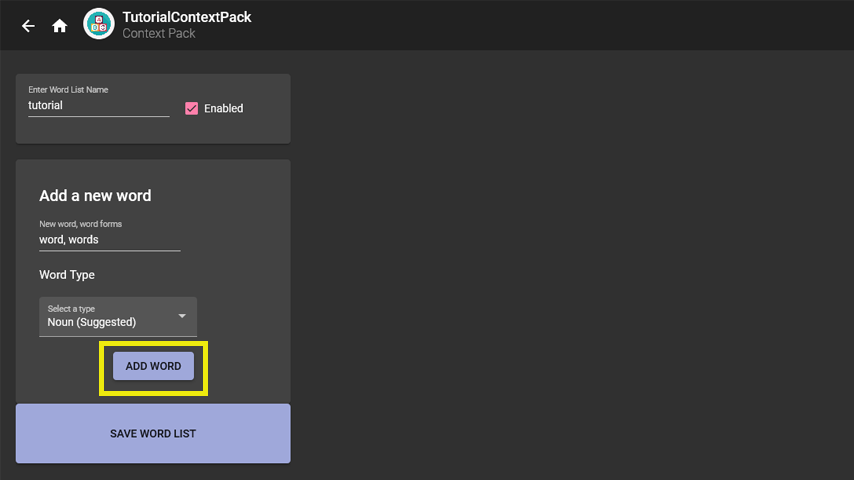
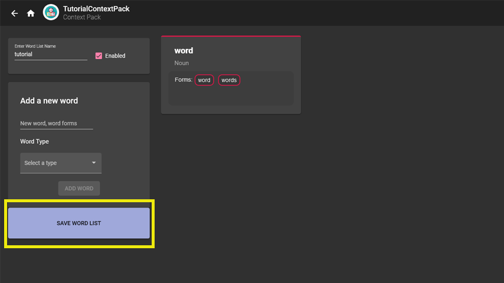
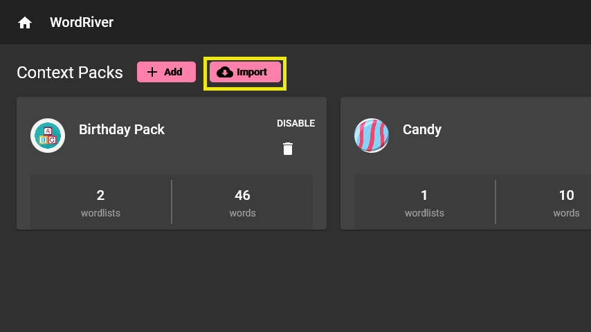
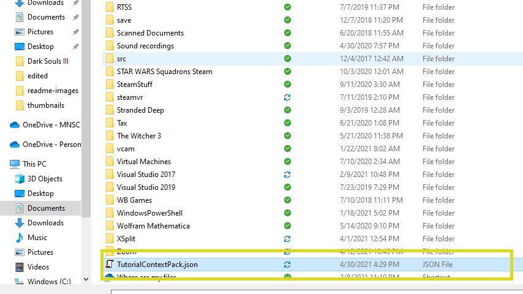
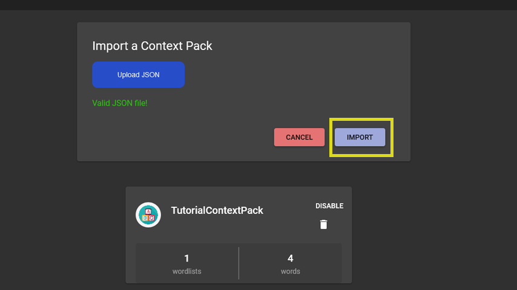
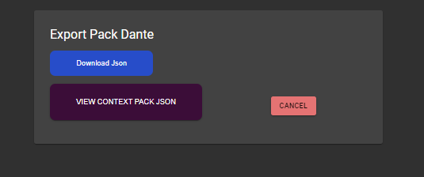
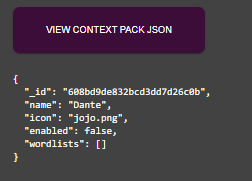
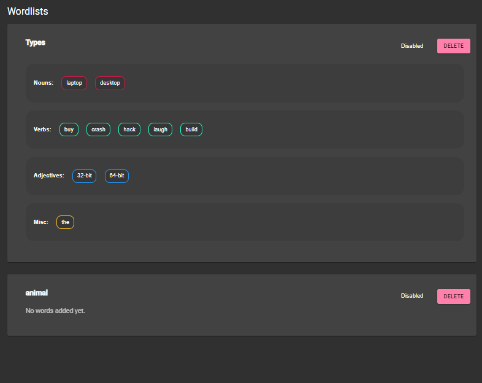
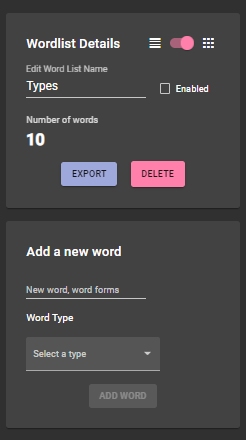

# How To Use Project Features <!-- omit in toc -->

- [Create Context Packs In App](#create-context-packs-in-app)
- [Import An Existing Context Pack](#import-an-existing-context-pack)
- [Change Context Pack Name](#change-context-pack-name)
- [Change Context Pack Enable/Disable Value](#change-context-pack-enabledisable-value)
- [Export Context Pack](#export-context-pack)
- [Tool Tips](#tool-tips)
- [Add Word](#add-word)

## Create Context Packs In App
1.) From the main page, click on the '+add' button. 
 
2.) Add a valid name. 
3.) Choose wether this context pack will be enabled in Story Builder. 
4.) (Optional) Add a link (URL) to an icon you would like for your context pack. 
5.) Once all required fields have valid information, you may click 'ADD CONTEXT PACK' button. 
 
6.) Click on 'ADD WORDLIST' button OR (optional) import wordlist JSON file.  
 
7.) Add wordlist name. 
8.) Select a wordlist type from the drop-down menu.  
9.) You may add words and their alternate forms to the 'new word' input field separated by commas. For example: "word, words" 
10.) Click 'ADD WORD' button. 
 
 
11.) Add as many words as you would like to the wordlists, then click 'SAVE WORDLIST' 
 
12.) Click 'SAVE CONTEXT PACK' 
 
13.) Congratulations, you've created a context pack! You may now go back and add more wordlists to it, or edit them. 

---
## Import An Existing Context Pack
1.) Click on the 'IMPORT' button. 
  
2.) Select a valid context pack JSON file.  
   
 
3.) Click the import button.  
  
4.) You will be brought back into the context pack editing screen. 
5.) Either edit your imported context pack, or click 'SAVE CONTEXT PACK' 

## Change Context Pack Name
1.) Click on a context pack. 
2.) You will see context pack details.  
  
3.)Look for the context pack name. 
  
4.)Change context pack name. 
  
5.) Click 'SAVE CONTEXT PACK'. 
 
6.)Context pack name is updated. 
  

## Change Context Pack Enable/Disable Value
1.) Click on a context pack.  
2.) You will see context pack details.  
  
3.)Look for the context pack 'ENABLE/DISABLE' button. 
  
4.)Click the 'ENABLE' button.  
5.)Context pack name is updated. 
  
6.)The value of the 'ENABLE/DISABLE' button should change. 
  
## Export Context Pack
1.) Click on a context pack. 
2.) You will see context pack details.  
  
3.) Click the 'EXPORT CONTEXT PACK' button. 
  
4.) You should see the export context pack page. 
  
5.) You cancel the export by pressing the cancel button. 
  
6.) Press the 'VIEW CONTEXT PACK JSON' button. 
  
7.) You should see the context pack json. 
  
8.) Press the 'DOWNLOAD JSON' button. 
  
9.) It will download the context pack JSON. 
  

## Tool Tips
1.) Click on a context pack. 
2.) You will see context pack page. 
  
3.) Hover over any word in the wordlists. 
  
4.) You will see the word and its form. 

## Add Word
1.) Click on a context pack.  
2.) You will see context pack page. 
  
3.) Click a wordlist. 
  
4.) You will see the wordlist details. 
  
5.) Look for 'Add a new word'. 
  
6.) Find add word and forms. 
  
7.) Type in the word and its forms. 
  
8.) Click the 'Add' button. 
  
8.)Word and Forms should add to the wordlist. 
  
 
